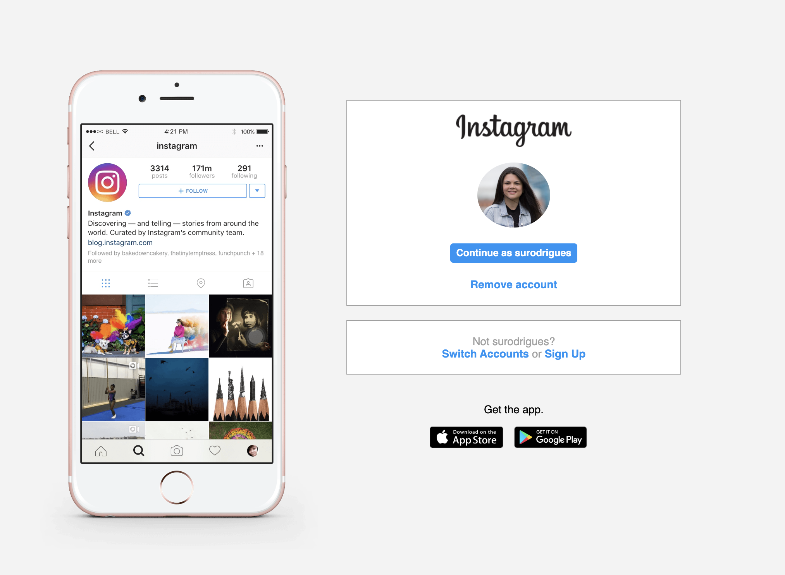
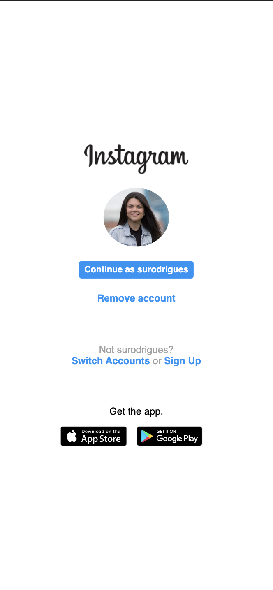

# DIO BOOTCAMP - Full Stack - CSS Project 2 using FlexBox
<h1 align="center"></h1>

Copy of Instagram's Login Page using FlexBox CSS. Second Project for the DIO FullStack Bootcamp 

<h3>:closed_book: About</h3>

The webpage was created to copy Instagram's login page.

<h3>:computer: Layout</h3>

The website was created to practice CSS FlexBox.

<h3 align="center" style="color: blue;">The page has some features of a responsive layout with 2 different breakpoints.</h3>

<h3>:sunrise: Technologies Used</h3>

The project was developed using the following technologies:

<code></code>
<code></code>
